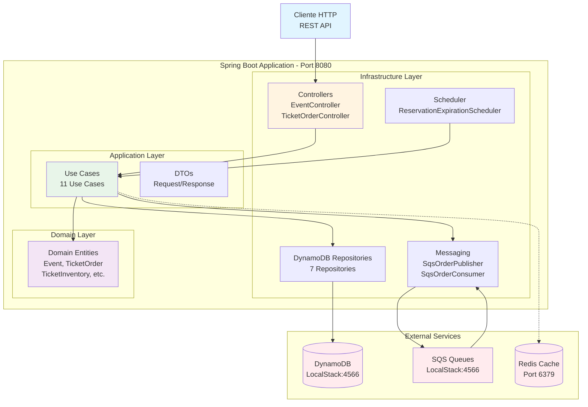
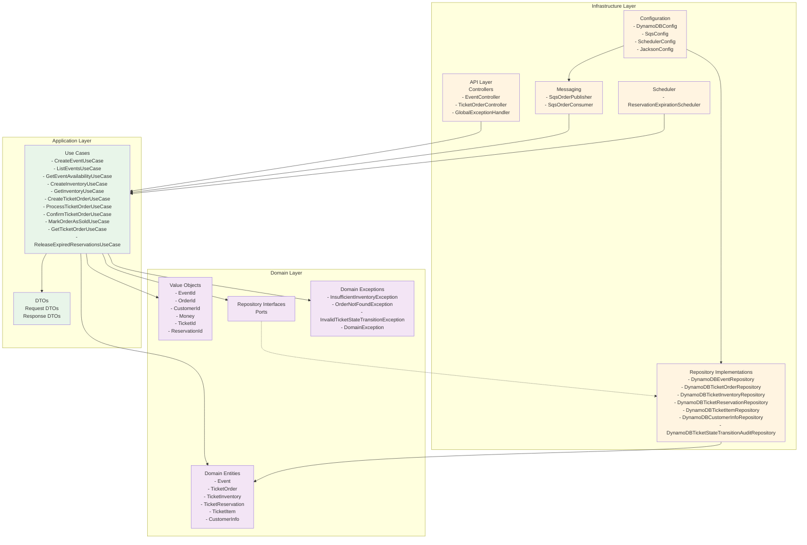

# Diagrama de Arquitectura - EventTicket System

## Arquitectura General del Sistema (Simplificada)

## Arquitectura por Capas (Clean Architecture)

## Componentes y Tecnologías

### Stack Tecnológico

| Capa | Tecnología | Propósito |
|------|-----------|-----------|
| **Framework** | Spring Boot 4.0-M1 | Framework base con soporte Java 25 |
| **API** | Spring WebFlux | API reactiva no bloqueante |
| **Lenguaje** | Java 25 | Records, Pattern Matching, Virtual Threads |
| **Base de Datos** | DynamoDB (LocalStack) | Event Sourcing y persistencia |
| **Mensajería** | SQS (LocalStack) | Procesamiento asíncrono |
| **Cache** | Redis | Caché distribuido |
| **SDK AWS** | AWS SDK v2 Async | Cliente reactivo para DynamoDB y SQS |

### Principios Arquitectónicos

1. **Clean Architecture**: Separación clara en 3 capas (Infrastructure, Application, Domain)
2. **Hexagonal Architecture**: Adaptadores (Controllers, Repositories) adaptan el mundo externo
3. **Domain-Driven Design**: Modelo de dominio rico con lógica de negocio en entidades
4. **Event Sourcing**: Eventos inmutables almacenados en DynamoDB
5. **CQRS Pattern**: Separación entre comandos (write) y consultas (read)
6. **Reactive Programming**: End-to-end reactivo con Spring WebFlux y AWS SDK Async
7. **Optimistic Locking**: Control de concurrencia sin bloqueos

### Patrones de Diseño Utilizados

- **Repository Pattern**: Abstracción de acceso a datos
- **Use Case Pattern**: Lógica de aplicación encapsulada
- **Adapter Pattern**: Controllers y Repositories como adaptadores
- **Value Object Pattern**: Objetos inmutables para valores del dominio
- **Factory Pattern**: Creación de entidades del dominio
- **Strategy Pattern**: Diferentes estrategias de procesamiento
- **Observer Pattern**: Eventos y notificaciones

## Escalabilidad y Rendimiento

- **Horizontal Scaling**: DynamoDB y SQS escalan automáticamente
- **Non-Blocking I/O**: Spring WebFlux con operaciones reactivas
- **Virtual Threads**: Java 25 para mejor concurrencia
- **Caching**: Redis para consultas frecuentes
- **Optimistic Locking**: Evita bloqueos en operaciones concurrentes
- **Async Processing**: SQS para desacoplar procesamiento pesado

## Seguridad y Observabilidad

- **Exception Handling**: GlobalExceptionHandler centralizado
- **Audit Trail**: TicketStateTransitionAudit para trazabilidad
- **Event Sourcing**: Historial completo de eventos
- **Health Checks**: Spring Actuator endpoints
- **Logging**: SLF4J con niveles apropiados
