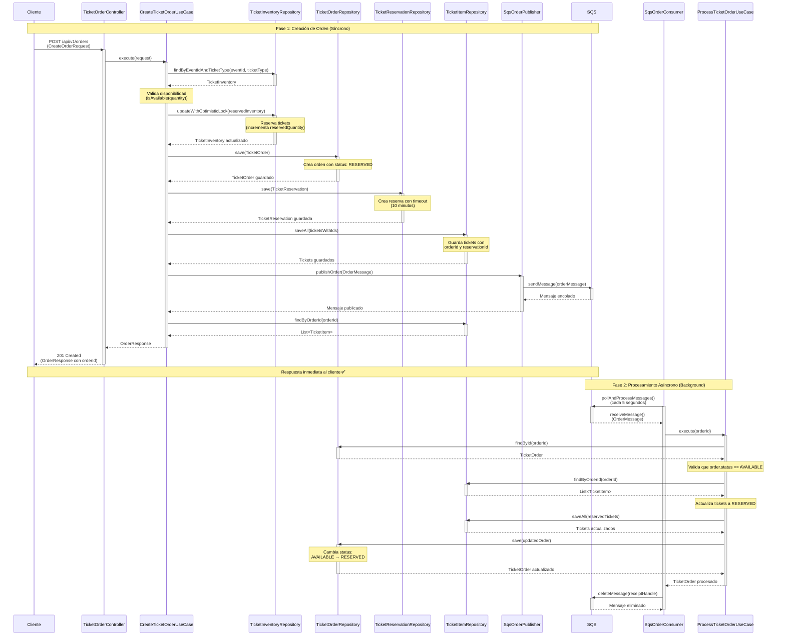
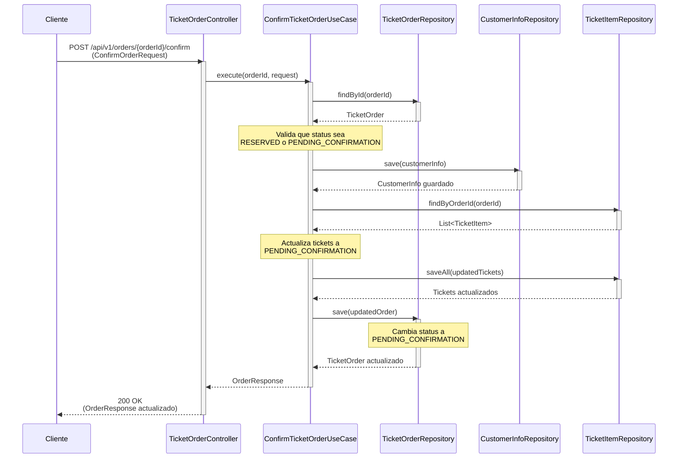
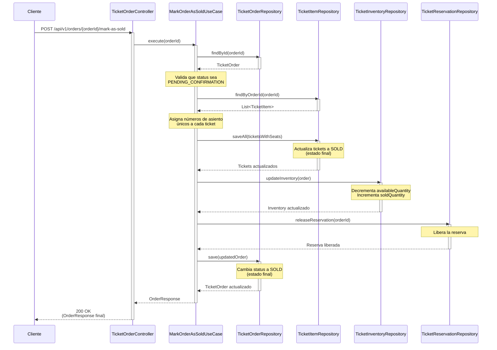
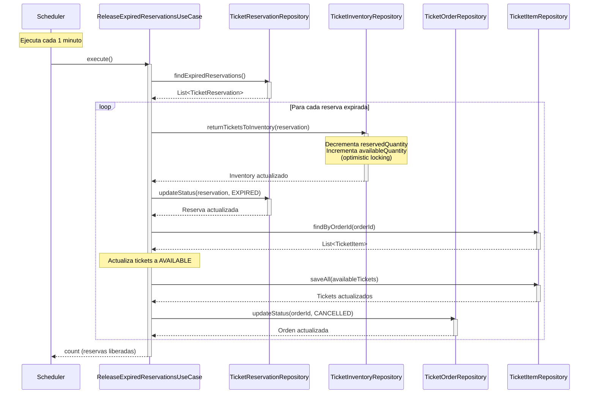

# Diagrama de Secuencia - Sistema de Tickets de Eventos

## Flujo Principal: Creación de Orden con Procesamiento Asíncrono

Este diagrama muestra el flujo completo de creación de una orden de tickets, incluyendo el procesamiento asíncrono mediante SQS.

## Flujo Alternativo: Confirmación de Orden

## Flujo Alternativo: Marcar Orden como Vendida

## Flujo Alternativo: Expiración de Reservas (Scheduled)

## Notas Importantes

### Estados de la Orden
- **AVAILABLE**: Estado inicial (antes de procesar)
- **RESERVED**: Orden creada, tickets reservados
- **PENDING_CONFIRMATION**: Orden confirmada con información de pago
- **SOLD**: Orden vendida (estado final)
- **CANCELLED**: Orden cancelada (reserva expirada)

### Estados de los Tickets
- **AVAILABLE**: Disponible para venta
- **RESERVED**: Reservado temporalmente
- **PENDING_CONFIRMATION**: Esperando confirmación de pago
- **SOLD**: Vendido (estado final)
- **COMPLIMENTARY**: Cortesía (estado final)

### Características Clave
1. **Respuesta Inmediata**: El cliente recibe el `orderId` inmediatamente después de crear la orden
2. **Procesamiento Asíncrono**: El procesamiento real ocurre en segundo plano mediante SQS
3. **Optimistic Locking**: Se usa para prevenir condiciones de carrera en el inventario
4. **Reservas Temporales**: Las reservas expiran después de 10 minutos
5. **Event Sourcing**: Todos los eventos se almacenan en DynamoDB para auditoría
