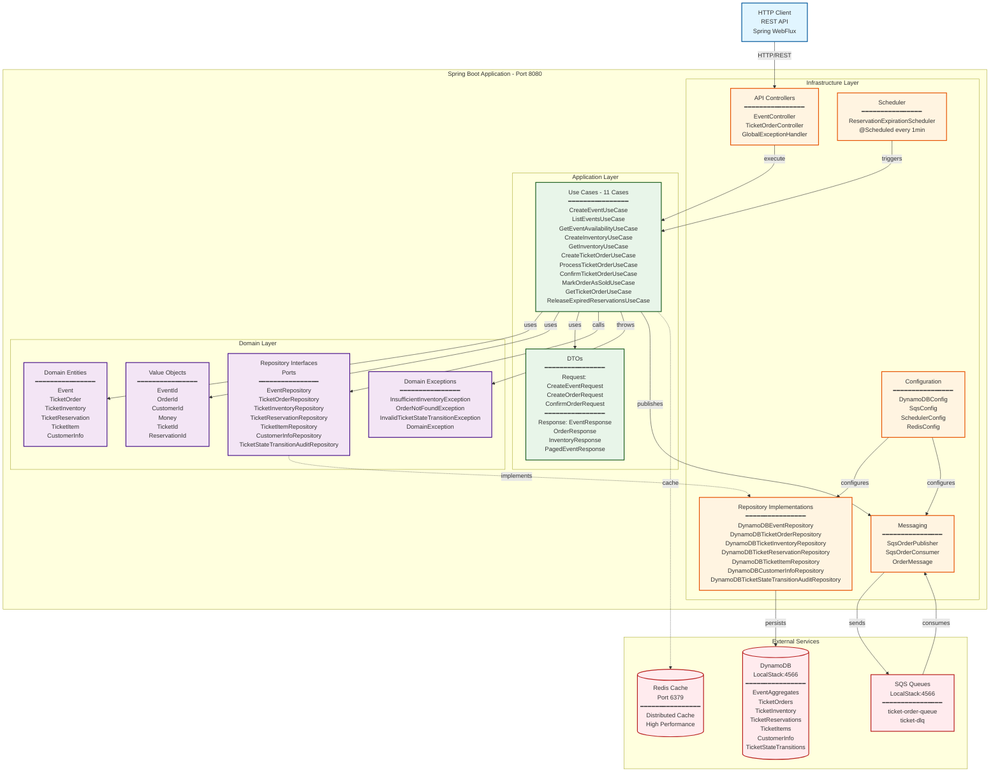
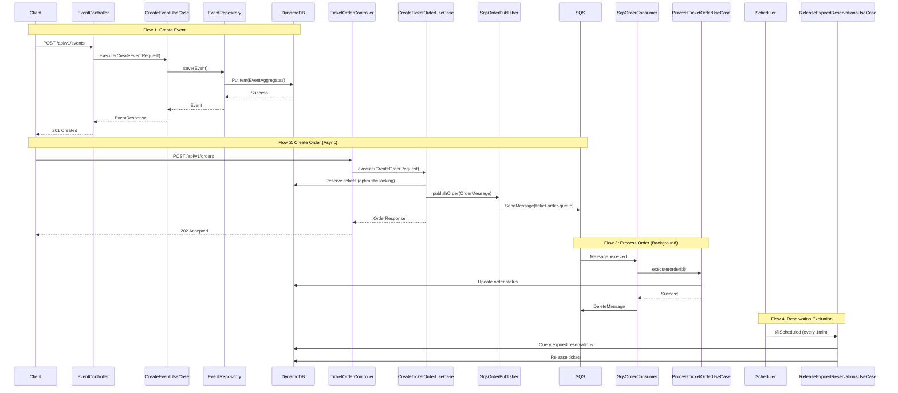

# Enhanced Architecture Diagram - EventTicket System

## General System Architecture (Detailed)



## Detailed Data Flow



## Layered Architecture (Clean Architecture)

```mermaid
graph TB
    subgraph "Infrastructure Layer - External Adapters"
        direction TB
        API[API Layer<br/>━━━━━━━━━━━━━━━━<br/>EventController<br/>TicketOrderController<br/>GlobalExceptionHandler]
        REPO[Repository Implementations<br/>━━━━━━━━━━━━━━━━<br/>7 DynamoDB Repositories<br/>AWS SDK v2 Async]
        MSG[Messaging<br/>━━━━━━━━━━━━━━━━<br/>SqsOrderPublisher<br/>SqsOrderConsumer<br/>@Scheduled polling]
        SCHED[Scheduler<br/>━━━━━━━━━━━━━━━━<br/>ReservationExpirationScheduler]
        CONFIG[Configuration<br/>━━━━━━━━━━━━━━━━<br/>DynamoDBConfig<br/>SqsConfig<br/>SchedulerConfig<br/>RedisConfig<br/>JacksonConfig]
    end

    subgraph "Application Layer - Use Cases"
        direction TB
        UC_EVENT[Event Use Cases<br/>━━━━━━━━━━━━━━━━<br/>CreateEventUseCase<br/>ListEventsUseCase<br/>GetEventAvailabilityUseCase]
        UC_INVENTORY[Inventory Use Cases<br/>━━━━━━━━━━━━━━━━<br/>CreateInventoryUseCase<br/>GetInventoryUseCase]
        UC_ORDER[Order Use Cases<br/>━━━━━━━━━━━━━━━━<br/>CreateTicketOrderUseCase<br/>ProcessTicketOrderUseCase<br/>ConfirmTicketOrderUseCase<br/>MarkOrderAsSoldUseCase<br/>GetTicketOrderUseCase]
        UC_RESERVATION[Reservation Use Cases<br/>━━━━━━━━━━━━━━━━<br/>ReleaseExpiredReservationsUseCase]
        DTO[DTOs<br/>━━━━━━━━━━━━━━━━<br/>11 Request DTOs<br/>11 Response DTOs]
    end

    subgraph "Domain Layer - Business Logic"
        direction TB
        ENT[Domain Entities<br/>━━━━━━━━━━━━━━━━<br/>Event<br/>TicketOrder<br/>TicketInventory<br/>TicketReservation<br/>TicketItem<br/>CustomerInfo]
        VO[Value Objects<br/>━━━━━━━━━━━━━━━━<br/>EventId, OrderId<br/>CustomerId, Money<br/>TicketId, ReservationId]
        REPO_INT[Repository Interfaces<br/>Ports<br/>━━━━━━━━━━━━━━━━<br/>7 Repository Interfaces]
        EXC[Domain Exceptions<br/>━━━━━━━━━━━━━━━━<br/>4 Custom Exceptions]
        ENUM[Enums<br/>━━━━━━━━━━━━━━━━<br/>OrderStatus<br/>TicketStatus<br/>EventStatus]
    end

    API --> UC_EVENT
    API --> UC_INVENTORY
    API --> UC_ORDER
    SCHED --> UC_RESERVATION
    MSG --> UC_ORDER
    
    UC_EVENT --> DTO
    UC_INVENTORY --> DTO
    UC_ORDER --> DTO
    UC_RESERVATION --> DTO
    
    UC_EVENT --> ENT
    UC_INVENTORY --> ENT
    UC_ORDER --> ENT
    UC_RESERVATION --> ENT
    
    UC_EVENT --> VO
    UC_ORDER --> VO
    UC_INVENTORY --> VO
    
    UC_EVENT --> REPO_INT
    UC_INVENTORY --> REPO_INT
    UC_ORDER --> REPO_INT
    UC_RESERVATION --> REPO_INT
    
    UC_ORDER --> EXC
    
    REPO_INT -.->|implements| REPO
    REPO --> ENT
    CONFIG --> REPO
    CONFIG --> MSG

    style API fill:#fff4e1,stroke:#e65100,stroke-width:2px
    style REPO fill:#fff4e1,stroke:#e65100,stroke-width:2px
    style MSG fill:#fff4e1,stroke:#e65100,stroke-width:2px
    style SCHED fill:#fff4e1,stroke:#e65100,stroke-width:2px
    style CONFIG fill:#fff4e1,stroke:#e65100,stroke-width:2px
    style UC_EVENT fill:#e8f5e9,stroke:#1b5e20,stroke-width:2px
    style UC_INVENTORY fill:#e8f5e9,stroke:#1b5e20,stroke-width:2px
    style UC_ORDER fill:#e8f5e9,stroke:#1b5e20,stroke-width:2px
    style UC_RESERVATION fill:#e8f5e9,stroke:#1b5e20,stroke-width:2px
    style DTO fill:#e8f5e9,stroke:#1b5e20,stroke-width:2px
    style ENT fill:#f3e5f5,stroke:#4a148c,stroke-width:2px
    style VO fill:#f3e5f5,stroke:#4a148c,stroke-width:2px
    style REPO_INT fill:#f3e5f5,stroke:#4a148c,stroke-width:2px
    style EXC fill:#f3e5f5,stroke:#4a148c,stroke-width:2px
    style ENUM fill:#f3e5f5,stroke:#4a148c,stroke-width:2px
```

## Components and Responsibilities

### Infrastructure Layer
- **API Controllers**: Receive HTTP requests, validate, call Use Cases
- **Repository Implementations**: Implement domain interfaces using DynamoDB
- **Messaging**: Publish and consume SQS messages for asynchronous processing
- **Scheduler**: Execute scheduled tasks (reservation expiration)
- **Configuration**: Configure Spring beans (DynamoDB, SQS, Redis, etc.)

### Application Layer
- **Use Cases**: Orchestrate application logic, coordinate repositories and entities
- **DTOs**: Transfer data between layers without exposing domain model

### Domain Layer
- **Entities**: Contain business logic and domain rules
- **Value Objects**: Immutable objects representing domain concepts
- **Repository Interfaces**: Contracts (ports) that define data access
- **Exceptions**: Domain-specific exceptions
- **Enums**: Domain states and types
